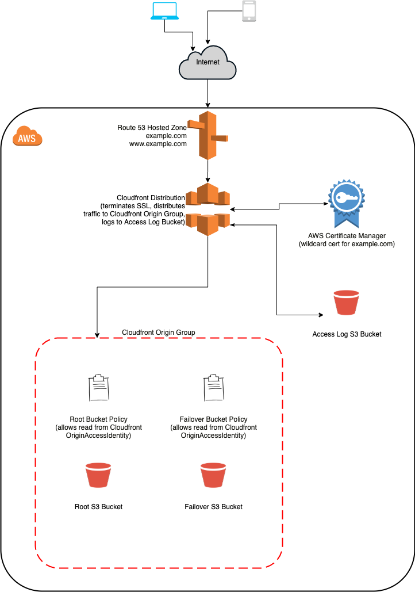

# lorem-static
A demonstration of the deployment of a static site

## Architecture
Amazon S3 buckets and Cloudfront (Amazon's CDN) have been set up in this example of static site infrastructure. It's been designed for speed, resilience and security and a basic illustration of its components is shown below:

## Deploying the Static Site Manually
### Prerequisites
- Access to deploy resources into an AWS account via Cloudformation. 
- A Route53 hosted zone (it is possible to set up using alternate DNS services but the example template includes R53 functionality).
- A wildcard SSL certificate generated from Amazon Certificate Manager in the *us-east-1* region ([Cloudfront can only utilise ACM records](https://docs.aws.amazon.com/AWSCloudFormation/latest/UserGuide/aws-properties-cloudfront-distribution-viewercertificate.html#cfn-cloudfront-distribution-viewercertificate-acmcertificatearn) from the Virginia region). There is documentation available [here](https://docs.aws.amazon.com/acm/latest/userguide/gs-acm-request-public.html) for the ACM certificate provisioning procedure. 
- *At least* a valid index.html (more likely it will be a compiled version of a static site). If you need a working example of a responsive HTML template, head to [http://html5up.net/](http://html5up.net/) for some Creative Commons licensed downloads. 
- An IAM user account to use to add / remove items from the bucket

### Deployment Procedure
- Head to the AWS Cloudformation console in the region of your choice, and choose 'Create Stack'
- Give the stack a meaningful name, add required parameter values in for:
    - *AdminAccountARN*: the AWS resource Name of the account used to administer the service (for S3 bucket access)
    - *ApexDomain*: choose whether your domain name is an apex one, i.e. example.com (apex) vs site.example.com (non-apex)
    - *CertificateARN*: the AWS Resource Name of the Amazon Certificate Manager SSL Certificate generated in advance, e.g. *arn:aws:acm:region:account:certificate/12345678-1234-1234-1234-123456789012*
    - *DomainName*: this is the domain name you'd like the website to be available on, e.g. *example.com*.
    - *DNSZoneID*: this can be found in the AWS Route 53 console for the DNS Hosted Zone you intend to use, e.g. *Z8VLZEXAMPLE*
- Optional parameter values can also be edited including:
    - *AutoS3Deploy*: to choose whether you will take advantage of the automated S3 deployment - more detail on this available (later in this README)[#s3-deploy]. If this is set true, accurate details must also be provided for S3DeployUserARN (below). 
    - *LogsLifecycle*: choose whether you'd like a lifecycle rule applied to the access logs created in the S3 Bucket. 
    - *S3DeployUserARN*: the AWS Resource Name of the IAM user to be used to automatically deploy to S3 from Github Actions- more detail on this available (later in this README)[#s3-deploy].
- Choose your own relevant notification settings or role to use to deploy the Stack, and if happy with the change set, deploy it out!
- Once the stack has been fully deployed, upload *at least* an index.html file to the 'root' bucket (accessible in the S3 console).
- The static site should then be accessible at the domain name you chose (and if it's an apex domain, at the 'www.' prefixed version of it too!)

## Scaling and Providing High Availability for the Service
### Amazon S3
Amazon S3 was chosen as the host for the website's content as a result of its built-in strength in reliability and durability. 
Data uploaded to S3 buckets in Amazon is spread across a *minimum* of 3 different availability zones, the data in buckets is rated at 99.999999999% durability over a given year. 
AWS [documentation](https://aws.amazon.com/s3/faqs/) states:
>  For example, if you store 10,000,000 objects with Amazon S3, you can on average expect to incur a loss of a single object once every 10,000 years. 
The SLA for availability in standard-class storage in S3 (used in this configuration) is 99.99% too, that works out to an agreement of under 4.38 minutes of downtime a month. 

The approach in this project is also to configure a 'failover' bucket which requests would be served from in the event of an outage in the primary bucket's 3 AZs - read more about that below in the ['Origin Group'](#origin-group) section of Cloudfront. 

### Amazon Cloudfront
Amazon Cloudfront is set up as part of the distribution here - Cloudfront is a CDN network which caches the content on the S3 bucket and delivers it to our users via whichever endpoint is going to respond the quickest. This ensures low latency and high data transfer rates. 
It also benefits from increased reliability and availability because the content is now cached in multiple locations around the world. 

Since the cache is important in maintaining good performance and reliability for the site, it's crucial we monitor the 'Cache Hit Ratio' - i.e. the proportion of requests to the original S3 bucket that are intercepted and served instead by Amazon Cloudfront.

***How to monitor that?***
***Talk about cache expiration in relation to static sites. ***

#### Origin Group
Failover has also been configured in Cloudfront - an 'origin group' is set up such that if Cloudfront's requests to the 'primary' S3 bucket fail, they will be rerouted to the 'failover' bucket automatically. 
In this configuration this is dependent on the deployment of identical content to both S3 buckets. 
Further investigation would be required to try and configure automatic S3 replication to a bucket in an alternative region. 
Illustrated [here](https://aws.amazon.com/blogs/apn/using-amazon-cloudfront-with-multi-region-amazon-s3-origins/), there's an approach involving a Lambda to intelligently route traffic to the origin chosen by Route53 which could be investigated too. 

## Using the Local Development Environment
Docker has been set up in order to help in the local development of the HTML for the static site. 
To use:
- Run: `docker-compose -d up` 
- Head to [http://localhost:8000](http://localhost:8000) and the contents of the 'src' folder should be being served. 

Changes made and saved to files in that folder should be accessible in the container upon refresh of the page!

## Deploying the Static Site Automatically
### Infrastructure as Code
- Create an IAM user in AWS that only has access to change Cloudformation resources (as detailed in [AWS Cloudformation Security Best Practises](https://aws.amazon.com/blogs/devops/aws-cloudformation-security-best-practices/) (along with creation of R53 records, S3 buckets, and Cloudfront Distributions). 
)
- Sign in to Azure Devops Pipelines and link to Github with the correct repo. 
- Add [AWS Toolkit for Azure DeOps Extension](https://marketplace.visualstudio.com/items?itemName=AmazonWebServices.aws-vsts-tools)
- Head to 'Project Settings' -> 'Service connections' -> 'New Service Connection'. 
- Find 'AWS' and add the credentials from the IAM user created above. 
- Create a pipeline linked from the correct repo in Github and use one of the 'azuredo' .yml files as the source of the pipeline. 
- In the 'edit' screen for the pipeline, add certificate_arn and dns_zone_id as secret variables. 
- Push up (depending on the conditions chosen in azuredo.yml) and the stack should be created!

### S3 Deploy
- Create a new IAM user which can be used to deploy to S3 via Github Actions. It's not necessary to assign any permissions, these will be passed using the bucket policy. 
- Add their access keys as S3_AWS_ACCESS_KEY_ID and S3_AWS_SECRET_ACCESS_KEY to the Github Settings -> Secrets console. 
- Set the Cloudformation parameter 'AutoS3Deploy' to 'true' and copy the IAM user's ARN into the 'S3DeployUserARN' parameter.
- Merge in to the Master branch (assuming that Infrastructure as Code is set up as above), or deploy the Cloudformation manually. 
- Add items to be uploaded to S3 to the 'src' folder in this repo (there is a sample template from [http://html5up.net/](http://html5up.net/) there by default). 
- Add the FAILOVER_S3_BUCKET and ROOT_S3_BUCKET bucket names in as secrets to the Github settings console. 
- Merge in to Master branch - the contents of the 'src' folder in this repo should be deployed automatically both to the failover and root bucket. 
